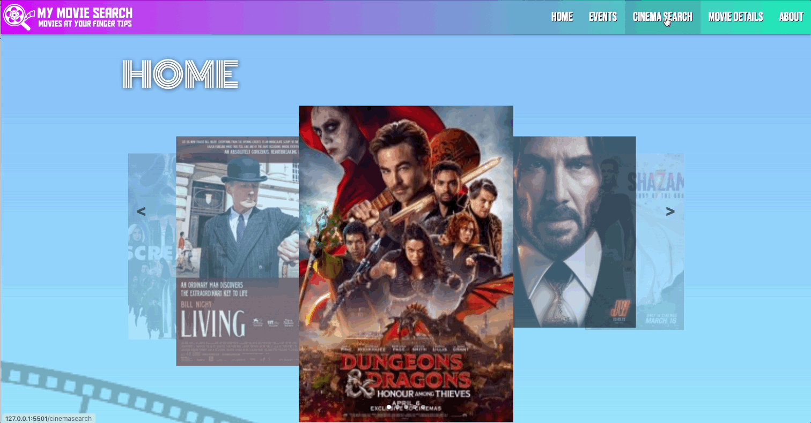
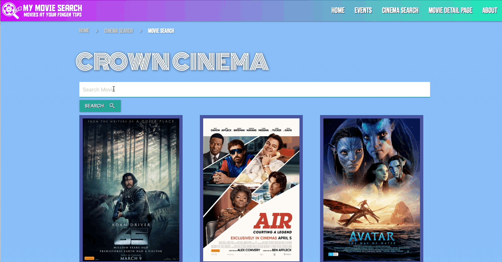
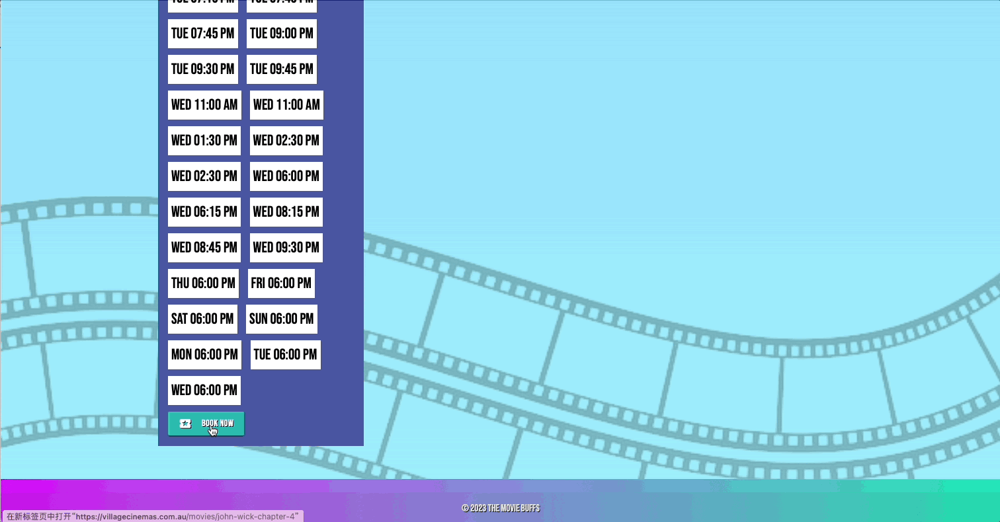

# Movie Tracker Website

A movie tracker website project that allows users to browse currently playing movies, view detailed information about movies and events, and find nearby cinemas. This project utilizes external APIs to fetch movie and cinema information.

You can find URL [here](https://emjkenz.github.io/My-Movie-Search/)

## Table of Contents

1. [User Stories and Acceptance Criteria](#user-stories-and-acceptance-criteria)
2. [Installation and Setup](#installation-and-setup)
3. [Mock-Up](#mock-up)
4. [API Documentation](#api-documentation)
5. [License](#license)
6. [Acknowledgements](#acknowledgements)

## User Stories and Acceptance Criteria

### User Story:

```
As a movie enthusiast, I want to be able to browse currently playing movies, view detailed information about movies and events, and find nearby cinemas, so that I can easily plan my movie-watching experience.
```

### Acceptance Criteria：

```
- SCENARIO: A user wants to browse the most popular movies currently showing in cinemas.

  - Given the user is on the HOME page,
  - When the user views the movie carousel,
  - Then the user should see a list of movies currently showing in cinemas with their respective posters.

- SCENARIO: A user wants to view more information about a specific movie.

  - Given the user is on the HOME page and sees the movie carousel,
  - When the user clicks on a movie poster,
  - Then the user should be taken to a detail page displaying more information about the selected movie.

- SCENARIO: A user wants to filter movies by cinema location.

  - Given the user is on the CINEMA SEARCH page,
  - When the user selects a cinema location from a menu lsit,
  - Then the user should see only movies currently showing in the selected cinema location.

- SCENARIO: A user wants to view movie showtimes for a specific cinema.

  - Given the user is on the cinema's movie listing page,
  - When the user views the movie list,
  - Then the user should see the showtimes for each movie at the selected cinema.

- SCENARIO: A user wants to book tickets for a movie.

  - Given the user is on the EVENTS page or movie listing page,
  - When the user clicks on the "Book Now" button,
  - Then the user should be redirected to an external booking website to complete their purchase.
```

## Installation and Setup

You can visit the Movie Tracker website by cloning the repository to your local computer and open the index.html file.

## Mock-Up

**Browse movies:**

Upon visiting the homepage, users will see a carousel displaying posters of recommended popular movies currently showing in cinemas. Users can wait for it to auto-scroll.


**View movie details:**

To view more information about a recommended movie on the home page, users can click on a movie poster in the carousel. This will take them to the movie detail page, where they can find a synopsis, age rating, trailer and other relevant information.


**Browse movies now showing:**

Users can browse all movies that are currently streaming on screen by clicking the "EVENTS" button on nar bar.

This will take them to the events page, where they can scroll down the screen to view all listed movies.


**Select cinema by location:**

Users can selecte a cinema by location from a menu list which contains all cinemas or by searching for a specifc localtion using the search bar.

After selecting a location, only the movies currently playing at the chosen cinema will be shown.



**Search for movies:**

Users can search for specific movies that are currently showing on the selected ceinema by typing a movie title into the search bar located at the top of the page.

As they type, the list of movies will be filtered to display only the matching titles.


**Check showtimes:**

On cinema's movie listing page, users can view the showtimes for each movie at the selected cinema.

The showtimes will be displayed alongside the movie title and other details.


**Book tickets:**

Users can book tickets for a movie by clicking on the "Book Now" button on the movie detail page or the movie listing page. This will redirect them to an external booking website where they can complete their purchase.


**Navigation:**

The website also features a side navigation menu for narrow screen , which can be accessed by clicking on the menu icon in the top left corner.

This menu provides links to different sections of the website, such as the homepage, the cinema listing, and the movie listing.


## API Documentation

This project uses the Village Cinema API and MovieGlu API to fetch movie information. To learn more about the API, please visit the [MovieGlu API documentation](https://developer.movieglu.com/documentation/).

## License

Include the appropriate license information for your project, such as MIT or GPL.

## Acknowledgements

- Movie data provided by the Village Cinema API and [MovieGlu API](https://www.movieglu.com/).
- Carousel functionality implemented using [MaterializeCSS](https://materializecss.com/).
